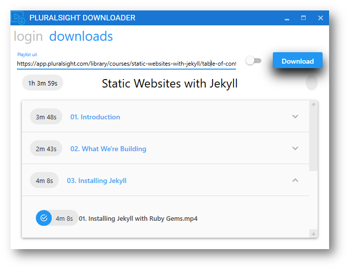

##Tutorials Downloader
This is a WPF wrapper application around [youtube-dl](https://github.com/rg3/youtube-dl) for downloading Pluralsight Courses, with a valid credentials.  

####Enter the Pluralsight Credentials & Download Location

####Paste the Course URI (ending with table-of-contents)

